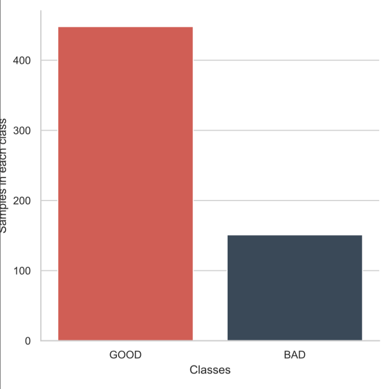
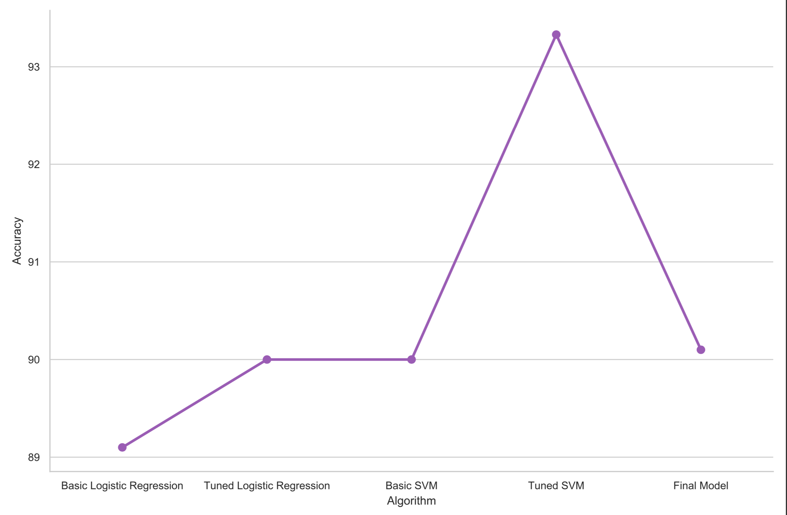
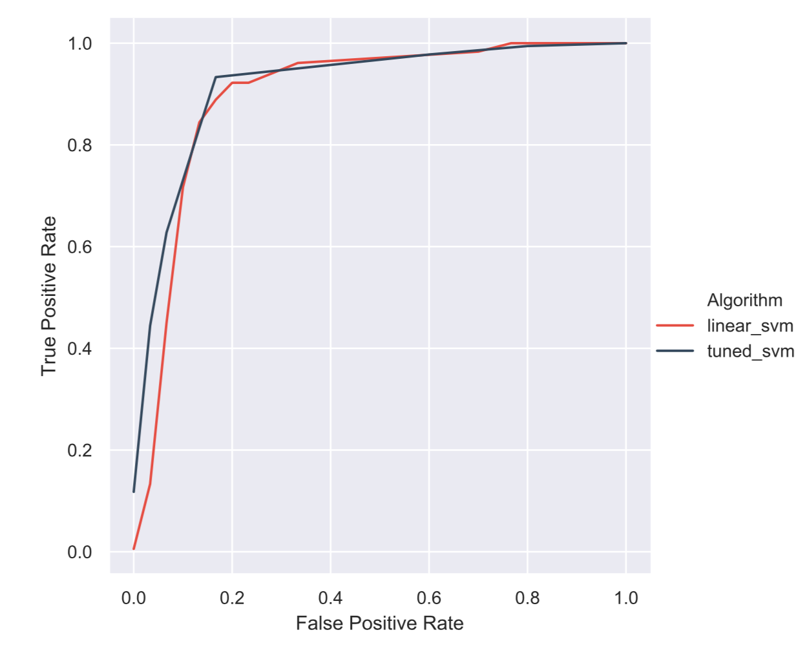

# Online-Social-Network-Behavioral-Analysis

**A machine learning classification problem to identify a good or bad friend.

**Datasets :**

1. For training -> train.csv -> created from a survey
2. For testing -> newtest.csv -> created from a survey

**Class distribution:**

for training set -> positive:negative ~ 80:20
for testing set -> positive:negative ~ 60:40

*All the features are categorical features.*

**Encoding:** 

1. OrdinalEncoder
2. LabelEncoder

**Algorithm used:** 

1. Logistic Regression
2. Support Vector Machine

*Hyper Parameter Tuning: GridSearchCV*

**Evaluation Metrices**

1. Accuracy -> almost 94% on dev set & 90.1% in unseen test set

2. ROC Curve

3. LogLoss

4. F1-score

5. Precision

6. Recall
